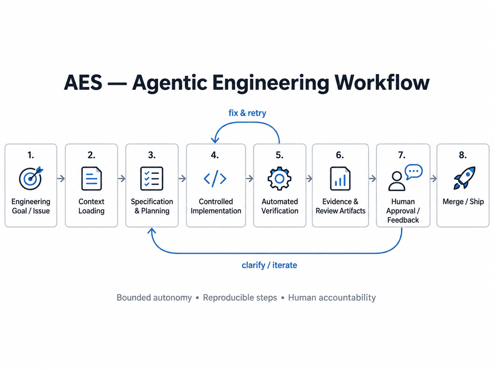
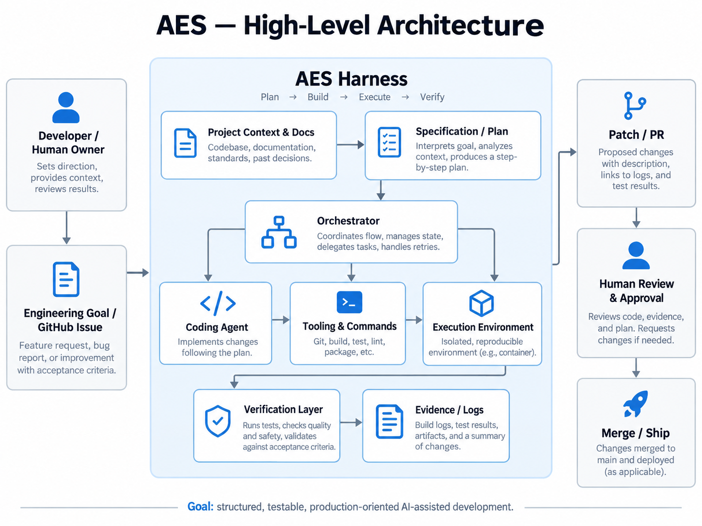
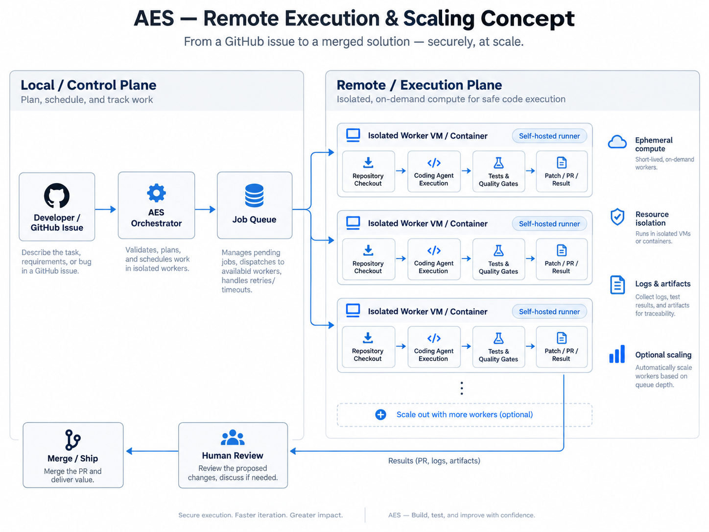

# Agentic Engineering System v0.1.0

Agentic Engineering System (AES) is a repository harness for accountable
agent-assisted software development. It is configuration, policy, portable
skills, automation, and deterministic evaluation—not an autonomous agent or a
replacement for human review.

## Why this exists

Agent-generated changes need the same provenance, isolation, safety checks, and
verification as any other production change. AES makes those expectations
executable while leaving the runtime and model provider replaceable. The core
idea is simple: an agent may prepare and verify work, but a human owns product
decisions, credentials, protected-branch integration, and the final merge.

Human accountability is explicit throughout the workflow. Claims are locked by
Git references, every feature starts with an eval, and automation fails closed
when required context or authorization is missing.

## Installation

AES is installed into a consumer repository as ordinary versioned files. The
consumer must have Git, Python 3.11 or newer, and a configured remote. Fetch a
trusted AES checkout, then run the synchronizer from the consumer root:
Install with the commands below, then review the resulting diff.

```sh
cd /path/to/consumer
/path/to/agentic-engineering-system/harness/scripts/aes-sync.sh --source /path/to/agentic-engineering-system
/path/to/consumer/harness/scripts/aes-sync.sh --check --source /path/to/agentic-engineering-system
```

The first command copies managed assets, seeds missing local configuration, and
merges only the managed hook keys. The second checks local drift against the
recorded source. `--check` does not prove that a consumer has the newest AES
revision; update the source and run the sync explicitly when upgrading.

The vendored `aes-harness-bump` workflow is disabled unless the consumer
explicitly defines the repository variables `AES_SOURCE_REPOSITORY` and
`AES_SOURCE_REF`. Those values select the trusted AES fork and release ref;
the workflow also stays disabled when the source is the current repository.
This makes the public repository and forks safe by default. Configure the
`AES_SYNC_TOKEN` secret only after reviewing the selected source and granting
the minimum repository and pull-request permissions.

## Components

### Core

- `harness/scripts/` provides clean-session orientation, feature worktrees,
  safe branch completion, push protection, review checks, and AES propagation.
- `harness/manifest.txt` records the source and destination of assets copied to
  a consumer; `.harness-version` records provenance and managed-file digests.
- `policies/` and `.agent/skills/` define the Git, documentation, task-claim,
  and harness protocols that travel with a consumer.
- `evals/` contains deterministic tests for the contracts, scripts, task flow,
  propagation, and safety boundaries.
- `.github/workflows/` runs the repository checks and provides optional review
  and propagation automation.

### Optional

- `harness/scripts/tasks/` adds GitHub-Issue task contracts, claim locks,
  readiness checks, dispatch, quota handling, and human escalation.
- `harness/scripts/agent-monitor/` records agent trajectory metadata in a local
  ledger for diagnostics; it does not export prompt or tool content by default.
- `scripts/codex-orchestrate/` and its skill provide an opt-in marker-based
  multi-turn CLI protocol. It is not required by the default workflow.
- Telemetry and queue configuration can be enabled by an operator when their
  privacy, budget, and infrastructure requirements are understood.

## Architecture and workflow

The repository is organized as six cooperating layers: contracts (`specs/` and
`evals/`), reusable know-how (`.agent/skills/`), external reach (MCP and
provider configuration), orchestration, guardrails, and verification with
observability. Provider-specific settings belong in configuration; application
logic stays model-agnostic.

A normal change follows this sequence:

1. Orient from the current checkout and confirm the branch is usable.
2. Read the state and roadmap, then write or update the feature eval before
   implementation.
3. Create a short-lived feature branch and worktree from the integration branch.
4. Implement the smallest change, run focused tests, and run the local review.
5. Open a pull request and wait for checks; a human reviews and merges it.

The Git workflow protects `main` and `develop`; direct pushes to either are
blocked. The task queue, when enabled, uses GitHub Issues as its control plane:
the contract is in the issue body, the `aes:*` label is status, and an atomic
Git ref is the claim lock. Losing a claim means moving to another task, never
deleting or replacing somebody else's lock.

### How AES fits together

AES keeps the development loop explicit: a human supplies the engineering goal,
the harness turns it into a bounded and verifiable workflow, and human review
remains the integration gate.



The repository groups those controls into portable layers rather than coupling
them to a single coding agent or provider.



Remote execution is intentionally a separate, optional path. It extends the
same issue, verification, and human-approval gates to an isolated worker; it
does not make the default local workflow autonomous.



## Safety and limits

AES is defensive tooling, not a security boundary by itself. Review shell
commands, provider permissions, workflow changes, and generated patches before
running them. Worktrees isolate tracked code, not shared data or external
services. Queue execution is subject to provider quotas, credentials, network
availability, and operator-configured resource limits. The harness cannot infer
product intent, validate external service terms, or safely resolve an ambiguous
human decision.

## Privacy

By default, telemetry is disabled and prompt, response, and tool content are
not sent to an export service. Local ledgers and configuration remain on the
machine unless an operator enables an integration. See [the privacy policy](docs/privacy.md)
for data-flow and operator responsibilities.

## Experimental

Remote workers and self-hosted queues are experimental. They require an
operator-managed host, credentials, resource controls, and an explicit review
of the data and network boundary. The local workflow is the supported baseline;
the repository does not promise a hosted service or unattended production
execution.

## Contributing

Read `AGENTS.md`, `policies/`, and the relevant skill before changing the
harness. Add an eval before new behavior, document meaningful design changes,
run the focused tests and the full required checks, and open a pull request.
Do not merge your own pull request unless the repository owner explicitly asks
you to do so.

## License

This release is available under the [MIT License](LICENSE).
